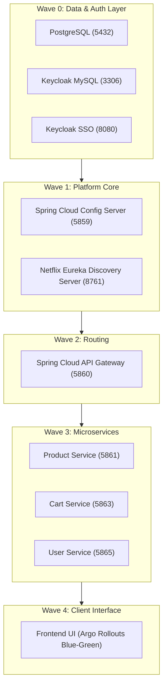

# ShopNow E-Commerce End-to-End Deployment and Operations Guide

This guide provides step-by-step instructions for deploying, operating, autoscaling, and managing the lifecycle of the ShopNow Microservices architecture on Amazon EKS using ArgoCD GitOps, KEDA Prometheus Autoscaling, and Karpenter Spot Node Optimization.

---

## 1. System Architecture and Startup Sequence (Sync Waves)

The ShopNow application consists of 8 microservice components orchestrated sequentially via ArgoCD Sync Waves to enforce dependency resolution during startup:



| Sync Wave | Component | Role / Purpose |
| :--- | :--- | :--- |
| Wave 0 | `shopnow-database-services` | Deploys PostgreSQL, MySQL, and Keycloak Authentication Service |
| Wave 1 | `shopnow-discovery-server` | Service Registry (Netflix Eureka) for internal service discovery |
| Wave 1 | `shopnow-config-server` | Centralized external configuration repository for Spring Boot microservices |
| Wave 2 | `shopnow-api-gateway` | Reverse Proxy and edge router distributing traffic to backends |
| Wave 3 | `shopnow-product-service` | Manages product catalog, pricing, and inventory |
| Wave 3 | `shopnow-cart-service` | Handles shopping cart state and checkout sessions |
| Wave 3 | `shopnow-user-service` | Manages customer profiles and role-based access control |
| Wave 4 | `shopnow-frontend` | Next.js/React web interface managed via Argo Rollouts Blue-Green deployment |

---

## 2. One-Click Deployment via GitOps

### Step 1: Initialize the ArgoCD AppProject
Grant ArgoCD permissions to manage the `shopnow` namespace on the `eks-workload` cluster:

```bash
kubectl --context eks-workload apply -f gitops/platform/addons/argocd/appproject-shopnow.yaml
```

### Step 2: Deploy All Applications
Apply the consolidated application manifest containing all 8 components:

```bash
kubectl --context eks-workload apply -f gitops/platform/bootstrap/shopnow-applications.yaml
```

ArgoCD automatically executes:
1. Namespace creation (`shopnow`).
2. Wave-by-wave deployment ordering (Wave 0 to Wave 4).
3. Readiness and liveness validation before progressing between waves.

### Step 3: Verify Deployment Status

```bash
# Check ArgoCD application sync status
kubectl --context eks-workload get applications -n argocd

# Monitor Pod initialization in real-time
kubectl --context eks-workload get pods -n shopnow -w
```

When all Pods transition to `Running (1/1 Ready)`, the application is fully operational.

---

## 3. Workload Autoscaling and Cost Optimization (KEDA + Karpenter)

Autoscaling is implemented using KEDA with dual triggers:
1. Schedule-based scaling (Cron) to scale workloads to 0 outside business hours.
2. In-cluster Prometheus metrics to scale workloads under traffic surges.

### Apply KEDA ScaledObjects:

```bash
kubectl --context eks-workload apply -f gitops/platform/addons/keda/shopnow-scaledobjects.yaml
```

### Operational Behavior:
* **Business Hours (09:00 - 19:00, Monday to Friday - Asia/Ho_Chi_Minh)**:
  - Base capacity is maintained at 1 Gateway replica and 2 replicas per backend service.
  - Under load, KEDA queries in-cluster Prometheus and scales replicas up to 5-6 Pods.
  - If node capacity is exceeded, Karpenter provisions additional EC2 Spot instances within 30-40 seconds.
* **Non-Business Hours (After 19:00, Weekends)**:
  - Workload replicas scale down to 0 (`minReplicaCount: 0`).
  - Karpenter detects empty worker nodes and terminates all Spot EC2 instances to eliminate idle infrastructure costs.

---

## 4. Load Testing and Scaling Verification

### Terminal 1: Monitor Autoscaling Metrics

```bash
while true; do clear; date; kubectl --context eks-workload get hpa,pods -n shopnow; sleep 2; done
```

### Terminal 2: Generate Synthetic Traffic
Run a multi-threaded load generator targeting the API Gateway:

```bash
kubectl --context eks-workload run load-tester --image=busybox --rm -it --restart=Never -- \
  sh -c "for i in \$(seq 1 15); do (while true; do wget -q -O- http://shopnow-api-gateway-service.shopnow.svc:5860/product > /dev/null; done) & done; echo 'Generating load... Press Ctrl+C to stop'; wait"
```

### Expected Observations:
1. Target metric in HPA exceeds the configured threshold.
2. Deployment replicas scale out (e.g., from 1 to 5 Pods).
3. Karpenter provisions new EC2 Spot nodes if existing instances run out of allocatable CPU/RAM.
4. Upon terminating the load test (`Ctrl + C`), the stabilization window (60s) elapses, HPA scales Pods back to base count, and Karpenter consolidates empty nodes.

---

## 5. Centralized Monitoring on Grafana

Access the centralized Grafana dashboard instance:
* **URL**: `http://k8s-monitori-grafana-389ed4b9d3-80693196.ap-northeast-1.elb.amazonaws.com`
* **Username**: `admin`
* **Password**: `dPs4myzdJOgbhbkRF0KJWLg0E9Pk8Qzxi1WTlvkF`

Key Dashboards:
1. **Workload and Pods 360 Operations**: Visualizes RPS throughput, 5xx server error rate, Pod CPU/RAM consumption, and HPA replica trends.
2. **KEDA Autoscaler (ID: 14513)**: Displays ScaledObject trigger health, Prometheus query metrics, and target evaluations.
3. **Node Exporter Full (ID: 1860)**: Provides hardware utilization metrics for underlying Karpenter EC2 instances.

---

## 6. Environment Lifecycle Management (Pause, Resume, Clean Destroy)

### Pause Workloads to Save Costs (Immediate Scale-to-Zero):
When pausing work during lab hours without deleting manifests:

```bash
# 1. Disable ArgoCD automated sync to prevent self-healing
kubectl --context eks-workload patch application -n argocd shopnow-config-server shopnow-discovery-server shopnow-frontend shopnow-database-services --type merge -p '{"spec":{"syncPolicy":null}}'

# 2. Pause KEDA and scale down all deployments and rollouts
kubectl --context eks-workload annotate scaledobject --all -n shopnow autoscaling.keda.sh/paused-replicas="0" --overwrite
kubectl --context eks-workload scale deployment,rollout --all -n shopnow --replicas=0
```
Karpenter will automatically terminate all empty worker nodes within 1 minute.

### Resume Workloads:
To restore the environment:

```bash
# 1. Unpause KEDA
kubectl --context eks-workload annotate scaledobject --all -n shopnow autoscaling.keda.sh/paused-replicas-

# 2. Re-enable ArgoCD automated self-healing
kubectl --context eks-workload patch application -n argocd shopnow-config-server shopnow-discovery-server shopnow-frontend shopnow-database-services --type merge -p '{"spec":{"syncPolicy":{"automated":{"prune":true,"selfHeal":true}}}}'
```
Karpenter will provision EC2 instances, and all microservices will be ready within 45 seconds.

### Complete Teardown (Clean Destroy):
To remove all ShopNow resources:

```bash
kubectl --context eks-workload delete -f gitops/platform/bootstrap/shopnow-applications.yaml
kubectl --context eks-workload delete namespace shopnow --ignore-not-found
```
